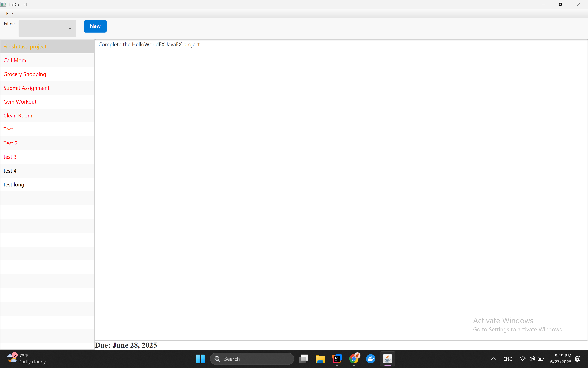

# 📋 JavaFX ToDo List

A simple and elegant desktop ToDo List application built with **Java 21** and **JavaFX**. This project helps users manage daily tasks with features like add, update, delete, and filter by deadline.

---

## 🚀 Features

- ✅ Add new ToDo items with description, details, and deadline
- 📝 Edit existing tasks via context menu
- 🗑️ Delete tasks with confirmation dialog
- 📅 Filter tasks by:
  - All
  - Today
  - Upcoming
- 🎨 Deadline color highlights:
  - 🔴 Overdue
  - 🟠 Due Tomorrow
  - ⚫ Future Tasks
- 💡 Clean and modern JavaFX styling using custom CSS

---

## 🛠 Tech Stack

| Layer         | Technology                     |
|---------------|--------------------------------|
| Language      | Java 21                        |
| UI Framework  | JavaFX (FXML + SceneBuilder)   |
| Styling       | JavaFX CSS                     |
| Build Tool    | Maven                          |
| Architecture  | Java Modules (`module-info.java`) |
| Persistence   | Local File System (`ToDoListItems.txt`) |
